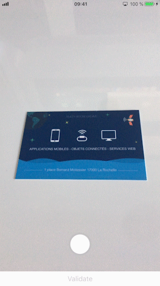
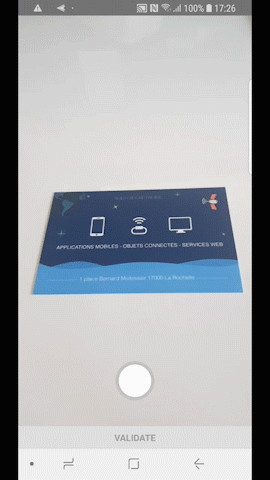

# react-native-document-scanner

## Preview

### iOS



### Android



## Getting started

Install the library using either Yarn:

`$ yarn add https://github.com/ubidreams/react-native-document-scanner`

or npm:

`$ npm install --save https://github.com/ubidreams/react-native-document-scanner`

### Using React Native >= 0.60

Linking the package manually is not required anymore with [Autolinking](https://github.com/react-native-community/cli/blob/master/docs/autolinking.md).

CocoaPods on iOS needs this extra step:

`$ cd ios && pod install`

## Dependencies

You need to add this packages as dependencies in your project :

- [react-native-svg](https://github.com/react-native-community/react-native-svg)

## Usage
```javascript
import RNDocumentScanner from 'react-native-document-scanner'

render () {
  return (
    <View style={styles.container}>
      <RNDocumentScanner />
    </View>
  )
}
```

## Credits
- for iOS : [SmartCrop](https://github.com/kronik/smartcrop)
- for Android : [LiveEdgeDetection](https://github.com/adityaarora1/LiveEdgeDetection)
- for image cropper component : [react-native-perspective-image-cropper](https://github.com/Michaelvilleneuve/react-native-perspective-image-cropper)

## TODO
- [ ] Support for landscape orientation
